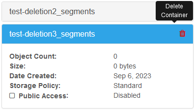

# OLRC Manual

Documentation for the OLRC, supplemental to Permafrost since Permafrost uses the OLRC.

- [OLRC Manual](#olrc-manual)
  - [Delete objects from a container (without deleting the container)](#delete-objects-from-a-container-without-deleting-the-container)
    - [Permafrost use case](#permafrost-use-case)
    - [Using the script](#using-the-script)
    - [Editing the script](#editing-the-script)
      - [Changing the container you delete from](#changing-the-container-you-delete-from)
      - [Deleting a specific set of files instead of everything](#deleting-a-specific-set-of-files-instead-of-everything)
  - [Delete orphaned OLRC segment containers](#delete-orphaned-olrc-segment-containers)
    - [What are segments?](#what-are-segments)
    - [What about segments containers?](#what-about-segments-containers)
    - [What is the solution?](#what-is-the-solution)

## Delete objects from a container (without deleting the container)

### Permafrost use case

The main use case for this script is for quickly deleting [files from the transfersource container in the Permafrost project](/docs/olivia-cheat-sheet.md#deleting-the-transfer-from-your-computer-and-horizon). If you use the [basic swift delete command](https://docs.openstack.org/python-swiftclient/latest/cli/index.html#swift-delete), it will allow you to delete individual files one at a time _or_ delete the entire container and everything in it. There is no built-in way via Swift CLI to delete all the objects but not the container. Hence why a script is necessary.

### Using the script

1. Make sure you're [Connected to Openstack](/docs/technical-setup.md#connecting-to-openstack).
2. Download the bash script [swift-delete-test.sh](/scripts/swift-delete-test.sh)
3. `cd` into the folder with the script
4. Run command `./swift-delete-test.sh`
   - if this does not work, you might have to grant permissions to run the script first using `chmod +x swift-delete-test.sh`
   - a list of deleted files will appear in the console and be saved in a text file called `deleted-objects.txt` ([see an example of this file here](/scripts/deleted-objects.txt))
5. Check the **transfersource** container, it should be empty now

### Editing the script

If you open the [swift-delete-test.sh](/scripts/swift-delete-test.sh) bash script you will notice that it's got comments explaining each line of code.

Below are some possible scenarios when you would want to change the script.

#### Changing the container you delete from

If you ever upload the wrong files to a container anywhere else in the OLRC, you can use this script to delete from those containers too.

1. If it's _not_ a container in Permafrost, make sure you source the right RC file for that project when you [Connected to Openstack](/docs/technical-setup.md#connecting-to-openstack).
2. Change `transfersource` in the `declare con="transfersource"` line of the script to the name of the container you want to delete.
3. Run the script as per [Using the script](#using-the-script)

#### Deleting a specific set of files instead of everything

If there's a specific folder or set of files you want to delete but you want to keep the other files in the container, do the following:

1. Use command `swift list transfersource > deleted-objects.txt`
2. Edit that txt file to only include the files you want to delete
3. Comment out line 10 (`swift list ${con} > deleted-objects.txt`) in the script by adding a hashtag to the start of it (`# swift list ${con} > deleted-objects.txt`)
4. Run the script as per [Using the script](#using-the-script)

Instructions above are also present in the bash script itself as a comment.

**Note:** This might still leave some leftover files if files have similar names (eg. if you uploaded several duplicates of the same transfer) but usually those leftover files are small in number and can be deleted via the Horizon interface

## Delete orphaned OLRC segment containers

Information in this section provided via email by Julie Shi, Digital Preservation Librarian at Scholars Portal

### What are segments?

In the OLRC, objects larger than 100MB are broken down into smaller segments for more efficient transfer. By default, when a large object is uploaded to a parent container, segments are stored in a separate container that has the same name as the parent container with "+segments" or "_segments" appended to the end. In the Horizon interface, segments containers can be viewed by selecting the Segments button above the container listing. When an object is deleted from the parent container, the associated segments are automatically removed from storage.

### What about segments containers?

When a parent container is deleted, however, the OLRC does not automatically delete the segments container in kind. This is because the CLI can be used to override the default behavior and specify which container segments are uploaded to. As such, a single container could be designated as the segments container for multiple parent containers and automatic deletion could cause unintended data loss.

### What is the solution?

Since we don't have many-to-one relationships between segment containers and main containers, we need to manually delete segment containers if the main container is also deleted or else that segment container will be "orphaned." Here's how to delete a segment container:

1. Select the "Segments" button to view the segments containers

2. Navigate to the relevant container
3. Confirm that there is no data in the container
4. On the information panel for the container, select the "Delete Container" button

5. Select "Delete" in the "Confirm Delete" popup window to complete the process
