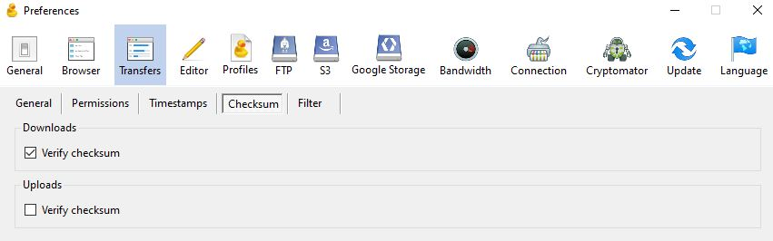

# Technical Setup

[Click here to go back to the main Table of Contents](/README.md)

- [Technical Setup](#technical-setup)
- [Accessing Permafrost subscriptions and logins](#accessing-permafrost-subscriptions-and-logins)
- [Mandatory Software](#mandatory-software)
  - [7-Zip / Unarchiver](#7-zip--unarchiver)
  - [Cyberduck](#cyberduck)
    - [Cyberduck setup](#cyberduck-setup)
      - [Connecting to Wasabi](#connecting-to-wasabi)
      - [Enabling checksum checking](#enabling-checksum-checking)
  - [makeCSV](#makecsv)
    - [makeCSV for Windows](#makecsv-for-windows)
    - [makeCSV for Linux and Mac](#makecsv-for-linux-and-mac)
  - [Bagger](#bagger)
    - [Bagger setup](#bagger-setup)
  - [Globus](#globus)
    - [Globus suddenly disappearing](#globus-suddenly-disappearing)
    - [Giving Globus access to external drives](#giving-globus-access-to-external-drives)
- [Command line tools (CLI)](#command-line-tools-cli)
  - [Mac Setup](#mac-setup)
  - [Windows Subsystem for Linux (WSL)](#windows-subsystem-for-linux-wsl)
    - [How to cd into Windows while using WSL](#how-to-cd-into-windows-while-using-wsl)
    - [WSL tips](#wsl-tips)
  - [ocrmypdf](#ocrmypdf)
  - [rclone](#rclone)
  - [Siegfried](#siegfried)
  - [Exiftool](#exiftool)
  - [Openstack and Swift CLI](#openstack-and-swift-cli)
    - [Connecting to Openstack](#connecting-to-openstack)
- [Navigation](#navigation)

# Accessing Permafrost subscriptions and logins

Make sure you're able to access the following pages:

- TMU Permafrost SPOTDocs: https://docs.scholarsportal.info/view/Main/SP/PER/Participant_Pages/TMU/
  - this page lists your username for Archivematica
- TMU Archivematica: https://archtorontomu.scholarsportal.info/
- TMU Horizon: https://olrc2.scholarsportal.info/horizon

# Mandatory Software

Get Library IT to install the following:

- [7-Zip / Unarchiver](#7-zip--unarchiver)
- [Cyberduck](#cyberduck)
- [makeCSV](#makecsv)
- [Bagger](#bagger)

## 7-Zip / Unarchiver

https://docs.scholarsportal.info/view/Main/SP/PER/Documentation/Permafrost_First_Time_Tool_Setup/#H2.7-Zip

- Used to open downloaded AIPs
- 7-Zip is for Windows, Unarchiver is for Macs
- Follow Permafrost documentation linked above

## Cyberduck

https://cyberduck.io/

- For viewing files and downloading files from Wasabi cloud storage

### Cyberduck setup

#### Connecting to Wasabi

After you have [downloaded and installed Cyberduck](#cyberduck), you need to set it up so it connects to TMU's Wasabi storage.

Use the [official Wasabi configuration instructions](https://knowledgebase.wasabi.com/hc/en-us/articles/115001671012-How-do-I-use-Cyberduck-or-Mountain-Duck-with-Wasabi#h_01HAWPGAGCE0PJ3JVH3SMAPCR8) alongside TMU-specific info:

For the **Connection Profile**, select the `S3 (Timestamps)` profile.

This profile will preserve the date metadata of the file when you download it. Any other profile will alter the date metadata to the Wasabi upload date (bad!).

For the **Open Connection** window:

- put `s3.wasabisys.com` as the **URL**
- get the **Access Key ID** and **Secret Access Key** from this [credentials.csv][REDACTED]
  - if you have trouble accessing that CSV file, ask MJ Suhonos for access

#### Enabling checksum checking

A checksum is a string of characters created from running every byte of a file against a hash algorithm. You can think of it as a "digital thumbprint" for the file. If a file is altered, edited, or corrupted, its checksum will change. If two files have the same checksum, then they are duplicates of each other. You can read more about checksums in the [DPC's Digital Preservation Handbook](https://www.dpconline.org/handbook/technical-solutions-and-tools/fixity-and-checksums).

Cyberduck cannot export its checksums but it does do checksum checking during downloads and uploads. Turn this on to make sure files are not altered during download.

1. Go to `Edit > Preferences... > Transfers > Checksum`
2. Make sure the **Verify checksum** box is checked for **Downloads**
   - You do not need to check it for **Uploads** because we have stopped uploading files to Wasabi.

3. Close Cyberduck
4. Open Cyberduck again and repeat steps 1-2 to make sure your **Preferences** were saved
5. If your **Perferences** were not saved, you will have to repeat steps 1-2 each time you open Cyberduck

## makeCSV

- Used to make the metadata.csv file for transfers
  - See [4. Make metadata.csv file](/docs/workflow-preprocessing.md#4-make-metadatacsv-file) for the exact steps where this tool is needed

### makeCSV for Windows

- Install using these official Permafrost instructions: https://docs.scholarsportal.info/view/Main/SP/PER/Documentation/Permafrost_First_Time_Tool_Setup/#HMakeCSV
- This will change the Windows Registry of your computer which would normally be concerning but as this was created by Scholars Portal it's perfectly safe

**Notes:**

- _Technically_ the makeCSV Windows installation is only supposed to work on files in the C drive (in other words, it doesn't work on external hard drives)
- _However_ Jessica has used it on external drives with no issues
- As a precaution...
  - Double check that the number of items in the resulting csv file matches the number of items in the objects folder if you do use it on an external hard drive
  - If you use makeCSV and get a pop-up saying "Maximum setlocal recursion level reached.", you should also do a csv vs objects folder comparison to make sure everything is captured. Sometimes if the directory path exceeds Windows' 260-character limit for paths then it won't list every file in the csv.

- Olivia ran into trouble using makeCSV after it was installed:
  - No csv was created
  - csv was blank
  - csv had missing files even when used on the C drive
- If this happens you will have to install [WSL](#windows-subsystem-for-linux-wsl) and follow instructions for [makeCSV for Linux and Mac](#makecsv-for-linux-and-mac) instead.

### makeCSV for Linux and Mac

- Instead of installing makeCSV, you will have to run a script each time you want to make a metadata.csv file
- Official Permafrost instructions for the script: https://docs.scholarsportal.info/view/Main/SP/PER/Documentation/Permafrost_First_Time_Tool_Setup/#H1B.Makecsv.shscriptforOSX
- [TMU Instructions for the script](/docs/workflow-preprocessing.md#makecsv-on-linux-and-mac)

## Bagger

https://github.com/LibraryOfCongress/bagger

- For bagging transfers (turning them into bags) prior to ingestion into Archivematica
  - See [5. Bag the transfer](/docs/workflow-preprocessing.md#5-bag-the-transfer) for the exact steps where this tool is needed
- Bagger is essentially a Graphic User Interface (GUI) for [bagit.py](https://github.com/LibraryOfCongress/bagit-python) which is built on the [BagIt standard](https://datatracker.ietf.org/doc/html/draft-kunze-bagit-17)
- Bags are structured data packages for transfer and storage which feature:
  - a directory listing (inventory of the folder's contents and its structure)
  - checksums for all the files
  - metadata about the bag itself
    - Bagger allows you to set specific fields for your bag metadata using a json file called a "Bagger profile", read on to [set up the profile](#bagger-setup)

### Bagger setup

1. Download TMU Bagger profile (json) [from Github](../scripts/TMU-profile.json)
2. Store json file in the bagger's home directory: /bagger
   - Windows: `C:Users\<user>\bagger`
   - Mac: `~/bagger`

3. Open Bagger
4. Click **Create New Bag**
5. Check that **TMU** is one of the options in the **Select Profile** drop-down menu

## Globus

Note for Lynn: You won't need this during our training but you will probably need it in the future so might as well get Simon to set this up while he's here

https://docs.scholarsportal.info/view/Main/SP/PER/Documentation/Permafrost_Processing_Workflow/2.b_Uploading_and_Managing_Transfers_in_Globus/

- For uploading transfers larger than 5 GB to Archivematica
- Turns your desktop into a Personal Globus Endpoint so you will need admin permissions from Library IT to install
- You will need to email Permafrost to give you access to the general TMU Globus endpoint that's connected to Archivematica
- Follow instructions linked above for installation

### Globus suddenly disappearing

If you don't use Globus for a while, the icon in your bottom menu will disappear and Globus will say your endpoint is not connected. To reconnect your endpoint, go to `This PC > OS (C:) > Program Files (x86) > Globus Connect Personal > bin` and then click on the application `globus_connect_personal.exe`

You can also `Right-click > Create shortcut` to add a shorcut to the application on your desktop so you don't have to go digging through folders to reconnect to Globus every time it disappears.

### Giving Globus access to external drives

By default, your personal Globus endpoint will only have access to your main drive (your C Drive). If you want to upload files from an external drive, you will have to give Globus permissions to access it. Follow the instructions linked in [Globus](#globus) to add another drive.

# Command line tools (CLI)

Command line tools are often faster and more reliable than the tools with Graphic User Interfaces (GUIs) like the [Mandatory Software](#mandatory-software) listed above. If you're comfortable with the command line interface (CLI) or are willing to learn, these are the reccomended tools for TMU's digital preservation workflow.

## Mac Setup

Macs run on Unix which is based off of Linux so no set up is necessary for CLI _unless_ the Mac requires admin permissions to run certain software.

## Windows Subsystem for Linux (WSL)

If you're using Windows, get Patrick to install a Linux distro on your desktop through [Windows Subsystem for Linux (WSL)](https://learn.microsoft.com/en-us/windows/wsl/install) so you can use the command line. Otherwise, you will be constantly blocked by permissions and will have to use Windows syntax for commands (this repository only uses Linux syntax).

If you use VS Code, Jessica reccomends the following extensions:

**Name: WSL: Recommender**

- Id: ms-vscode-remote.remote-wsl-recommender
- Description: Recommends using the Windows Subsystem for Linux (WSL) and the WSL extension.
- Version: 0.0.19
- Publisher: Microsoft
- VS Marketplace Link: https://marketplace.visualstudio.com/items?itemName=ms-vscode-remote.remote-wsl-recommender

**Name: Copy Path (Unix Style)**

- Id: baincd.copy-path-unixstyle
- Description: Copy absolute and relative Windows paths to clipboard in Unix/Linux/POSIX style.  Can be configured to copy paths in Git Bash format, WSL format, Cygwin format, Windows forward-slash format, and Windows double-backslash format.
- Version: 2.0.0
- Publisher: Chris Bain
- VS Marketplace Link: https://marketplace.visualstudio.com/items?itemName=baincd.copy-path-unixstyle

### How to cd into Windows while using WSL

With WSL, you are essentially running a Linux computer within your Windows computer. By default, your main drive (where you go when you input `cd` and nothing else) is your Linux drive.

To access your Windows drive, use:

`cd /mnt/c`

This will take you to the root of the drive, so you will still have to `ls` and `cd` into your `Users` folder and then into your profile to access files specific to your account.

This also works for external drives. For example, if I wanted to `cd` into the T7 Shield drive below, I would use the command:

`cd /mnt/e`

### WSL tips

If you are using Windows Subsystem for Linux (WSL), move the OpenStack RC File into your Linux user folder so you don't have to cd into the right directory every time you need to connect to the OLRC. You should already be starting in the right directory.

If you're using WSL and copying files from your Windows system into your Linux system, a bug can occur where a zone identifier file is created alongside the original file being copied. (You might need to refresh the folder to see it.) Delete this file.

## ocrmypdf

https://ocrmypdf.readthedocs.io/en/latest/index.html

Use with parallel if you want to OCR PDFs en masse: https://ocrmypdf.readthedocs.io/en/latest/batch.html#batch-jobs

## rclone

https://rclone.org/

- rclone install https://rclone.org/install/ 
- Configuring Wasabi for rclone https://rclone.org/s3/#wasabi

## Siegfried

https://www.itforarchivists.com/siegfried/

- Siegfriend has better file format identification than DROID (eg. DROID can identify PDF versions, but it can't detect PDF/A flags like Siegfried can.) Siegfried website can reliably identify smaller files, but large files need the CLI.

## Exiftool

https://exiftool.org/

- Useful for:
  - Extracting metadata as csv for the metadata.csv file (eg. date created, number of pages in PDF, etc.)
  - Removing metadata (eg. XMP metadata)
- In theory you can do the above in Bridge but it requires writing / finding scripts for Bridge, Jessica found it easier to just use Exiftool

## Openstack and Swift CLI

- OpenStack and Swift CLI
  - Faster / more reliable than Horizon or Globus and can handle transfers of any size
  - Installation https://learn.scholarsportal.info/all-guides/cloud/swift-cli/
    - You will have to download python for Linux first if you're using WSL: https://www.geeksforgeeks.org/how-to-install-python-in-ubuntu/
  - Manual https://docs.openstack.org/python-swiftclient/latest/cli/index.html
  - UofT instructions https://permafrost.groups.io/g/main/message/84

### Connecting to Openstack

1. In the directory with your OpenStack RC File and use

`source permafrost-openrc.sh`

It will ask for your Horizon password. Put in your password and press enter. Note: As a safety precaution most passwords entered via command line don't appear as text. When you type, no text will appear, but the input is still being registered.

2. Issue a token for your account

`openstack token issue`

3. Authorize your account / access using that token

`swift auth`

# Navigation

[Click here to go back to the main Table of Contents](/README.md)
