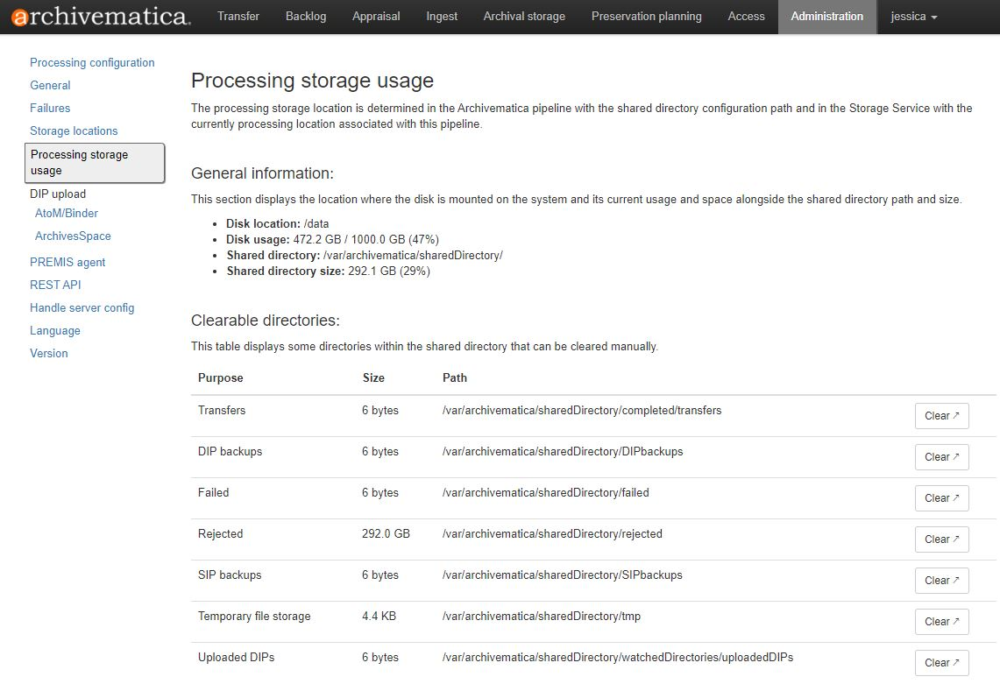

# Processing in Archivematica

[Click here to go back to the main Table of Contents](/README.md)

- [Processing in Archivematica](#processing-in-archivematica)
  - [Permafrost documentation](#permafrost-documentation)
  - [Check processing storage](#check-processing-storage)
  - [Check microservices](#check-microservices)
    - [Job: Characterize and extract metadata](#job-characterize-and-extract-metadata)
      - [Cause for failure #1: Corrupted file](#cause-for-failure-1-corrupted-file)
      - [Cause for failure #2: Metadata does not conform to schema](#cause-for-failure-2-metadata-does-not-conform-to-schema)
    - [Job: Move access files to DIP](#job-move-access-files-to-dip)
    - [Job: Verify bag and restructure for compliance](#job-verify-bag-and-restructure-for-compliance)
  - [Transfer tab](#transfer-tab)
  - [Ingest tab](#ingest-tab)
    - [Normalization options](#normalization-options)
    - [Review and approve the SIP (small transfers)](#review-and-approve-the-sip-small-transfers)
    - [Review and approve the SIP (large transfers) (CLI)](#review-and-approve-the-sip-large-transfers-cli)
  - [Checking the AIP](#checking-the-aip)
  - [Viewing the AIPs in Archival storage](#viewing-the-aips-in-archival-storage)
    - [Notes for navigating Archival storage](#notes-for-navigating-archival-storage)
    - [Checking the AIP via Archival storage](#checking-the-aip-via-archival-storage)
  - [Deleting the transfer from your computer and Horizon](#deleting-the-transfer-from-your-computer-and-horizon)
- [Navigation](#navigation)

## Permafrost documentation

See Permafrost documentation [3. Processing Transfers in Archivematica](https://docs.scholarsportal.info/view/Main/SP/PER/Documentation/Permafrost_Processing_Workflow/3._Processing_Transfers_in_Archivematica/)

Read these instructions and use them as the main guide for processing in Archivematica. Everything outlined below is supplemental to Permafrost documentation.

## Check processing storage

If your transfer is **smaller than 100 GB** go to [Check microservices](#check-microservices)

If your transfer is **100 GB or larger** keep reading this section.

The processing thresholds of TMU's Archivematica instance is available on the [TMU spotdocs page](https://docs.scholarsportal.info/view/Main/SP/PER/Participant_Pages/TMU/). Currently our max transfer size is 250 GB because our processing space is 1 TB (Archivematica processing space needs to be at least 4 times the size of the transfer based on reccomendations by Artefactual). Scholars Portal will clear out our processing space when the capacity reaches 80%, but for large transfers it's best to check our processing space before you ingest anything.

1. Go to the **Administration** tab
2. Click **Processing storage usage**
3. Click **Calculate disk usage** and it should show a screen like this:



- 472 GB, nearly half the disk, is being used
  - A majority of that is taken up by 292 GB worth of rejected transfers
- This means there's currently only 538 GB of processing space so any transfer that's larger than 134.5 GB will likely fail. (538 / 4 = 134.5)

4. If there is enough space for your transfer, continuing processing it. If there isn't, then email Permafrost's Digital Preservation Librarian and Scholars Portal will clear up processing space from the backend (aka delete some files in the Virtual Machine that's running Archivematica).

## Check microservices

As you work through the [Transfer tab](#transfer-tab) and [Ingest tab](#ingest-tab), the best practice is to open every microservice and check for failed jobs. Some failed jobs will cause the SIP to fail upon ingest, but some failed jobs will still create a SIP or AIP. A failed job is not always fatal and its consquences don't always need to be corrected, but it should still be checked before it's dismissed or managed.

Below are some examples of failed jobs and how to manage them, refer back to this section if you encounter failed jobs in any of the microservices as you work through the [Transfer tab](#transfer-tab) and [Ingest tab](#ingest-tab).

### Job: Characterize and extract metadata


If this job fails, a SIP will still be created but technical metadata might be missing from it. This is not a fatal error because:

- the metadata is still retained in the files themselves and can be extracted at a future date
- usually, only one specific metadata extraction tool (eg. Exiftool) has been affected, but because Archivematica uses multiple metadata extraction tools it's possible that the metadata from those other tools were preserved by Archivematica

But it's still worth investigating because:

- important technical metadata might be missing from the METS XML file
- the failure is indictive of corrupted or otherwise undesireable files

Because the cause of the failure can be complicated, the next best step will be to email Permafrost and get help from their Digital Preservation Librarian.

You can also try to analyze the error yourself if you are comfortable reading command line output and XML. Below are examples for why this job might fail:

#### Cause for failure #1: Corrupted file

Click on the gear icon of the failed job and read the **Standard output (stdout)** XML output for the failed task


You can tell it's a failed task because the **Exit code** is red


The key part here is this section:

```xml
<ExifTool:Warning>Processing TIFF-like data after unknown 0-byte header</ExifTool:Warning>
 <ExifTool:Error>File format error</ExifTool:Error>
 <System:FileName>2009-002-2184-011.tif</System:FileName>
 <System:Directory>/var/archivematica/sharedDirectory/watchedDirectories/workFlowDecisions/extractPackagesChoice/2009-002-TO_Canadian-Architect-Magazine-Toronto-Series-8d1599c2-7e0d-4364-b0fd-7a2ce28d2bba/objects/2009-002-TO_Toronto-Series</System:Directory>
 <System:FileSize>8 bytes</System:FileSize>
```

- error is that Exiftool has found a 0-byte header in what appears to be a TIFF file
- in other words, it's a TIFF file with no data in it
- size of he file (8 bytes) confirms this as there is no way our high-quality digitized TIFF scans would be 8 bytes

Checking the file (2009-002-2184-011.tif) revealed that it is indeed corrupted and cannot be opened by any file viewer. In this scenario, you can either:

1. Reject the transfer, rescan the photo, add it to the transfer
2. Reject the transfer, remove the corrupted file, reingest the transfer

#### Cause for failure #2: Metadata does not conform to schema

1. Click on the gear icon of the failed job and search the page for `Errors and diagnostics (stderr)` At the bottom of the dialog box is the error. In the example below, it says `XML output for command "ExifTool" (99d5f508-7733-4e86-883f-bd6abc3fbac7) was not valid XML; not saving to database`


2. Recall the error is `XML output for command "ExifTool" (99d5f508-7733-4e86-883f-bd6abc3fbac7) was not valid XML; not saving to database`
3. Search the page for `Exiftool` to find the source of the error, in this case it's a warning that `Frame &#39;TDRC&#39; is not valid for this ID3 version`


- ID3 is a [de facto standard for metadata in MP3 files](https://en.wikipedia.org/wiki/ID3) and `TDRC` is the [Exiftool Tag ID for `RecordingTime`](https://exiftool.org/TagNames/ID3.html#v2_4)

4. Use [Exiftool](/docs/technical-setup.md#exiftool) on the file and discover the following output:

```console
[ID3v2_3 directory, 103 bytes]
```

```console
  | Warning = [minor] Frame 'TDRC' is not valid for this ID3 version
  | RecordingTime = October 1994
  | - Tag 'TDRC' (13 bytes):
  |     0064: 00 4f 63 74 6f 62 65 72 20 31 39 39 34          [.October 1994]
```

- the embeded file metadata is using ID3 version 2.3
- however, ID3v2_3 [does not have the RecordingTime field](https://id3.org/id3v2.3.0), only [ID3 version 2.4](https://id3.org/id3v2.4.0-structure) does
- hence, when Exiftool extracted this data and brought up this error, Archivematica rejected it and failed to ingest it into the METS XML

In this scenario, you can either:

1. Fix / remove the embeded technical metadata using an external tool, reingest the transfer
2. Leave the transfer as is and continue processing

In this case, after consulting with Permafrost, TMU went with option 2 because:

- ffprobe and MediaInfo captured enough technical metadata to make up for the lack of technical metadata from Exiftool
- it would be too cumbersome to sort out which files are affected and fix them
- the files are born-digital so this embeded technical metadata, however invalid, was inserted by the record creator and born-digital files shouldn't be altered as long as it doesn't cause major technical problems / need to be normalized due to concerns of obsolescence

### Job: Move access files to DIP


If this job fails in the Ingest tab, then the SIP will fail and you will have to restart the transfer. Click on the gear icon for the job to see more details about the failure.


In the example above, Archivematica was trying to move access files into the DIP (`Module manualNormalizationMoveAccessFilesToDIP_v0.0`) but couldn't find a matching file (`File matching query does not exist.`) hence the job failure.

Specifically, it was looking for this file: `manualNormalization/access/RG4-10/RG4-10-05/RG4-10-02-010.pdf` based on the structure of the `objects` folder in the transfer. However, there isn't such a file in the `manualNormalization` folder because the file in the `objects` folder was misnamed.

Notice the file is `RG4-10-02-010.pdf` but the folder it's nested in is `RG4-10-05`. In other words, `RG4-10-02-010.pdf` should actually be `RG4-10-05-010.pdf`. Because the file was correctly named in the `manualNormalization` folder (`RG4-10-05-010.pdf`) Archivematica wasn't able to match it with the incorrect file name in the `objects` folder (`RG4-10-02-010.pdf`) hence the job failure.

The problem was fixed by renaming all the incorrectly named files in the `objects` folder, rebagging the transfer, and reprocessing it.

### Job: Verify bag and restructure for compliance


This job is part of the microservice **Approve transfer** which is also the first microservice that your transfer will go through upon ingest. If this job fails, the transfer will fail and you will have to reingest.

If job fails, that means something is wrong with the bag, such as:

- there are more/less files in the transfer than listed in the manifest
- one of the files has been corrupted / altered in some way and no longer has the same checksum / size
- the directory structure is different than expected
- etc

This job will tell you the exact error if you click the gear icon.

Essentially it's just running bagit<nolink>.py to validate the bag (the same thing Bagger uses). For more info on bags / BagIt see [Technical Setup: Bagger](/docs/technical-setup.md#bagger).

## Transfer tab

See Permafrost documentation [1. Start the transfer in Archivematica](https://docs.scholarsportal.info/view/Main/SP/PER/Documentation/Permafrost_Processing_Workflow/3._Processing_Transfers_in_Archivematica/#H1.StartthetransferinArchivematica)

**IMPORTANT NOTES:**

- Make sure to choose **Unzipped bag** for the **Transfer type** or else the ingest will fail
- The transfer name should be: reference-number_Title-of-Level
  - Archives Example:
    - RG122-04_FORUM-newsletter-1987-1994 
    - (fonds-number-series-number_Series-Title)
  - Special Collections Example:
    - 2005-001-08-01-12_Eastman-Kodak-Company-annual-reports
    - (fonds-number-series-number-file-number_File-Title)
- Currently, we are not adding an Accession no. or an Access sytem ID
- Click browse to "add" a folder to ingest
- After you press **Start transfer**, do _not_ press it again or start the same transfer again even if nothing appears in the Archivematica **Transfer** tab for a while.
  - Archivematica needs to download the transfer from OLRC/Globus into the virtual machine that Archivematica is being hosted in, so this can take a while. If you start the process again you're going to end up with duplicated transfers that you have to reject and possibly delete if they are large transfers that take up processing space. See [Check processing storage](#check-processing-storage) for more details.

## Ingest tab

### Normalization options

See Permafrost documentation [2. Process the transfer](https://docs.scholarsportal.info/view/Main/SP/PER/Documentation/Permafrost_Processing_Workflow/3._Processing_Transfers_in_Archivematica/#H2.Processthetransfer)

A more detailed analysis of the exact normalization rules for our instance is available here [TMU-NormalizationRules.xlsx][REDACTED]

Formats we have already analyzed:

- PDF
- JPEG
- TIFF
- MOV
- MP3
- EXIF
- JP2
- WAV

If your transfer only contains files with the above formats, go to Review and approve the SIP for [small transfer](#review-and-approve-the-sip-small-transfers) or [large transfers](#review-and-approve-the-sip-large-transfers-cli)

If your transfer contains a format that hasn't been analyzed before, see the documentation on [Analyzing normalization rules for new file format](/docs/analyzing-normalization-rules.md)

### Review and approve the SIP (small transfers)

If your transfer is small (under 200 items) then follow the instructions below. If your transfer is large (over 200 items) go to [Review and approve the SIP (large transfers)](#review-and-approve-the-sip-large-transfers-cli)

1. Choose **Normalize for preservation and access** and wait until **Job: Approve normalization** appears
   - Do _not_ choose **Do not normalize** as this will cause the SIP to fail and you will have to re-ingest the transfer. 
   - Even if you have manually normalized files, choose **Normalize for preservation and access** because the first step in Archivematica's normalization process is to check for manually normalized files.
2. Before you approve the normalization, review it by clicking on the report icon next to the gear icon (see Permafrost documentation for screenshot)
3. Look through _every single page_ of the normalization report to make sure:
   - Every file was successful (no red cells)
   - That the `metadata.csv` file isn't present
     - If the `metadata.csv` file is in the normalization report, that means the transfer wasn't correctly bagged and you will need to bag again
4. If not successful, investigate the failure by clicking the link in the red cell and contact Permafrost if you can't decipher the error. (Note: learning how to [analyze normalization rules](/docs/analyzing-normalization-rules.md) can help you decipher the error.)
5. If everything looks good, approve the normalization
6. Store the AIP
7. Store the DIP in **Public Access in Horizon**

### Review and approve the SIP (large transfers) (CLI)

If your transfer is large (over 200 items) then follow the instructions below. If your transfer is small (under 200 items) go to [Review and approve the SIP (small transfers)](#review-and-approve-the-sip-small-transfers)

The instructions below _require_ the use of the command line and the associated WSL installation for Windows computers. If you are unable to use the command line you can use the method outlined in [Review and approve the SIP (small transfers)](#review-and-approve-the-sip-small-transfers), it will just take more time as you will have to wait for each page to load and depending on the number of files in your transfer it can be very time-consuming.

**If it is your first time using this script** make sure to run this command first:

`sudo apt-get install -y libxml2-utils`

So you have access to [xmllint](https://linux.die.net/man/1/xmllint), a command line tool that is used in this script. If you've used this script before then skip to step 1.

1. Choose **Normalize for preservation and access** and wait until **Job: Approve normalization** appears
   - Do _not_ choose **Do not normalize** as this will cause the SIP to fail and you will have to re-ingest the transfer. 
   - Even if you have manually normalized files, choose **Normalize for preservation and access** because the first step in Archivematica's normalization process is to check for manually normalized files.
2. Before you approve the normalization, generate a normalization report by clicking on the report icon next to the gear icon (see Permafrost documentation for screenshot)
3. Right-click on the page and choose **Inspect** from the drop-down menu. This will open the developer console.
4. In the developer console, click on the **Application** tab (you might have to click on the arrow to see more tabs).
5. Open the **Cookies** menu under **Storage** and click on the URL in it. The console should now display the **crsftoken** and the **sessionid** cookies which you will need to run the script.


6. Download the script [report_downloader_v3.sh](/scripts/report_downloader_v3.sh) and move it into whatever folder you want the exported report (a csv file) to be. For an example report, see [report.csv](/scripts/report.csv).
7. `cd` into the folder with the script and run command `chmod +x report_downloader_v3.sh` to grant permissions to run the script.
8. The command for the script has the following structure:

`./report_downloader_v3.sh ${REPORT_URL} ${NUMBER_OF_PAGES} csrftoken=${CSRF_TOKEN} sessionid=${SESSION_ID} > report.csv`

Here's an example command with all the values filled out:

`./report_downloader_v3.sh https://archtorontomu.scholarsportal.info/ingest/normalization-report/1b62327d-09bd-4c91-8d51-fe81dd9258f5/ 16 csrftoken=***REMOVED*** sessionid=***REMOVED*** > report.csv`

Here's a breakdown of each part of the command:

`${REPORT_URL}` = the URL for the normalization report

- make sure it's for _the first page_ of the report
- make sure the URL ends in a backslash `/`

`${NUMBER_OF_PAGES}` = the number of pages for the report

- To calculate: divide the total number of items in the report by 10. If there is a remainder, plus 1 (e.g., 1143/10 = 114.3 --> total pages = 115)
- There is currently an upper limit of 1000 for the page count
- If no page count is given, the script will only return the last page of results

`${CSRF_TOKEN}` = put the value for **crsftoken** here

`${SESSION_ID}` = put the value for **sessionid** here

9. Open `report.csv` and check that:
   - Every file was successful
   - That the `metadata.csv` file isn't present
     - If the `metadata.csv` file is in the normalization report, that means the transfer wasn't correctly bagged and you will need to do bag again
10. If not successful, investigate the failure by clicking the link in the relevant cell and contact Permafrost if you can't decipher the error. (Note: learning how to [analyze normalization rules](/docs/analyzing-normalization-rules.md) can help you decipher the error.)
11. If everything looks good, go back to Archivematica and approve the normalization
12. Store the AIP
13. Store the DIP in **Public Access in Horizon**

## Checking the AIP

See Permafrost documentation [2. You've Just Made an AIP (or DIP): A Checklist](https://docs.scholarsportal.info/view/Main/SP/PER/Documentation/You%27ve_Just_Made_an_AIP_%28or_DIP%29%3A_A_Checklist/)

Best practices encourage you to download the AIP and check it was ingested corrected (see above link). However, this is extremely tedious as it can be very slow and requires you have enough storage space. Use your judgement to decide if you want to follow this step. (eg. Smaller transfers are easier to download and check, but it's the larger transfers where things are more likely to mess up.)

One alternative to downloading the AIP is to [check the AIP via Archival storage](#checking-the-aip-via-archival-storage). This always you to check certain basic aspects of the AIP to ensure that its basic components are correct. However, a proper full check follows the Permafrost documentation linked above.

## Viewing the AIPs in Archival storage

In the **Archival storage** tab of Archivematica, you can check all the AIPs that have been ingested. If you click on the **Select columns** button at the bottom of the page you can choose what AIP metadata gets displayed.


### Notes for navigating Archival storage

- The column **File count** does _not_ accurately reflect the actual number of files in the AIP. It usually displays more files than what is actually in the transfer.
- The AIP name does not always consistently conform to the naming convention of `reference-number_Title-of-Level` so it is not a reliable way to search for specific AIPs. Always search in `Transfer metadata` for the most accurate title, reference number, fonds number, etc.
  - The inconsistencies were created at the beginning of TMU's digital preservation program when workflows had not been solidified yet. Renaming the AIPs requires downloading and re-ingesting them which is time-consuming so TMU has opted not to.

### Checking the AIP via Archival storage

Ensure you have read the everything else in [Viewing the AIPs in Archival storage](#viewing-the-aips-in-archival-storage) before reading this section.

By searching **Archival storage**...

|You can check|You _cannot_ check|
|---|---|
|Whether the AIP metadata was correctly applied (aka whether the metadata.csv file is correct)*|Whether the preservation copies normalized correctly|
||The folder structure of the AIP|

*If the file has an unusual name (eg. uncommon characters) then you will need to [follow Permafrost documentation and download the METS XML](#checking-the-aip)

Refer to the metadata.csv file you downloaded from [the Transfers Metadata folder][REDACTED] as part of [Preprocessing / Pre-Ingest Procedures: # 4. Make metadata.csv file](/docs/workflow-preprocessing.md#4-make-metadatacsv-file) to check the metadata.

First check the fonds number:

1. Put the fonds number in the blank search field _in quotes_
2. Change **Any** to **Transfer metadata**
3. Change **Keyword** to **Phrase**

This will display all the AIPs in that fonds, the AIP you're looking for should be displayed there. If it isn't, you will have to [check the AIP according to Permafrost documentation](#checking-the-aip).


Also check that the **dc<nolink>.title** of the files has been correctly applied. You don't have to check every file, but check enough files from different levels of the folder structure (if there are multiple folders) to feel comfortable assuming that the metadata has been applied correctly.

Follow the same steps as checking the fonds number except replace the fonds number with the **dc<nolink>.title**. This should show you the AIP with the relevant file:


Then check **Show files?**. This should show you the exact file with that **dc<nolink>.title**.


In some cases, the file you're looking for won't show up. This is likely because the metadata has unique or nonstandard characters that has been encoded differently than expected. You will have to [check the AIP according to Permafrost documentation](#checking-the-aip).


In the example above, the **dc<nolink>.title** "2022 - 10_30AM.mp4" does not appear as expected.

## Deleting the AIP

If you check the AIP (whether it's using [official Permafrost documentation](#checking-the-aip) or just [viewing it through Archival storage](#viewing-the-aips-in-archival-storage)), discover that it's wrong, and want to delete it, you will need to notify Permafrost:

1. Go to **Archival storage**
2. Click on the AIP you want to delete
3. Go to the **Delete** tab under **Actions**
4. Copy the AIP's UUID into the **UUID** field and include a reason to deletion (eg. mistake)
5. Press **Delete**
6. Email Permafrost letting them know you put in an AIP deletion request

## Deleting the transfer from your computer and Horizon

After you have processed the transfer into a AIP and are _certain_ you no longer need it, delete the transfer from your computer and Horizon. Once something has been deleted from the OLRC it cannot be recovered! You might even want to [create access links](/docs/workflow-access.md) first before you delete anything, just to be extra safe.

It is important to regularly clear out our **transfersource** container in Horizon to avoid increasing our OLRC storage costs. If we have an unprocessed transfer in Horizon and have the processed AIP for that transfer in Archivematica, then we are essentially paying to store duplicates of the same materials. OLRC charges by the terabyte so we are unlikely to accidentally exceed our storage, but it can quickly add up (especially with large video and image files) so best practice is to delete whenever possible.

Permafrost has documentation for deleting files from the Horizon interface: [Deleting Packages from Horizon](https://docs.scholarsportal.info/view/Main/SP/PER/Documentation/Permafrost_Processing_Workflow/2._Uploading_and_Managing_Transfers_in_Horizon/#HDeletingPackagesfromHorizon). However, this can be very slow / freeze entirely if you try to delete a large amount of files at once. You then have to go into each folder and delete objects page by page which can be extremely tedious.

Jessica has written a script which allows you to more reliably and efficiently delete files from the **transfersource** container (or any other OLRC container) using the [Swift CLI](#software). See [OLRC Manual](/docs/olrc-manual.md) for more information.

# Navigation

Click here to go back to the main [Table of Contents](/README.md)

Click here to go back to [Preprocessing / Pre-Ingest Procedures](/docs/workflow-preprocessing.md)

Click here to go to [Creating Access Links](/docs/workflow-access.md)
