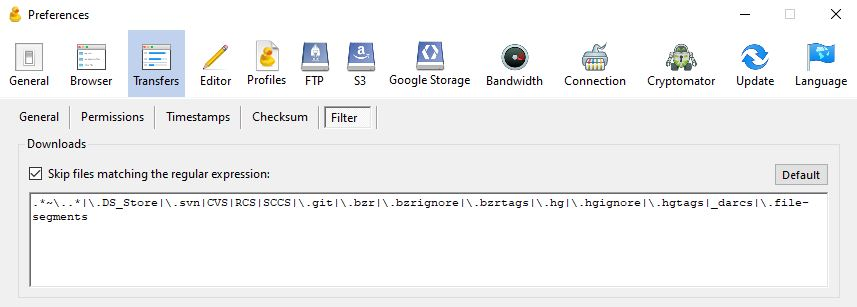
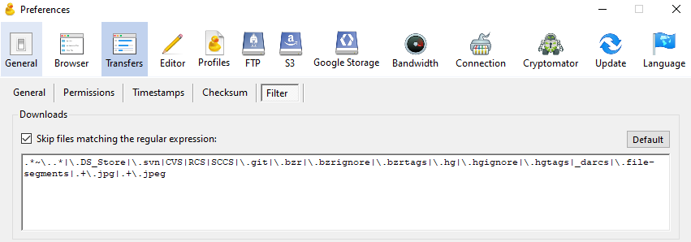
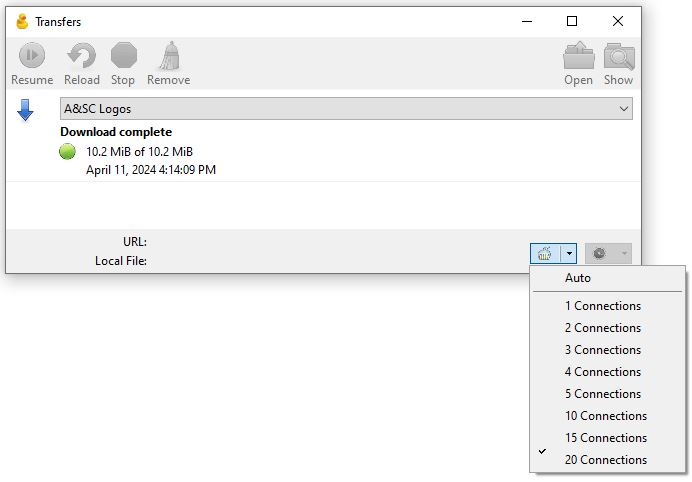
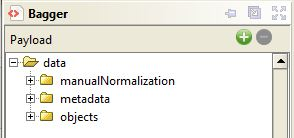
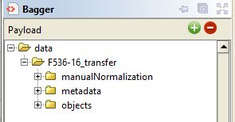
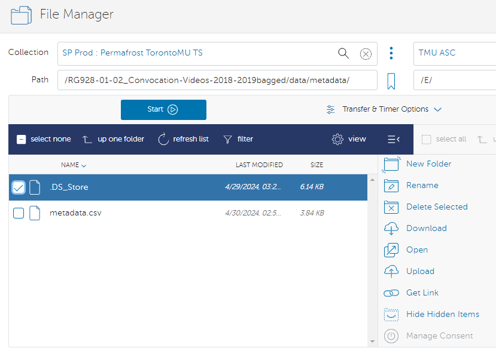

# Preprocessing / Pre-Ingest Procedures

[Click here to go back to the main Table of Contents](/README.md)

- [Preprocessing / Pre-Ingest Procedures](#preprocessing--pre-ingest-procedures)
- [1. Decide what to process](#1-decide-what-to-process)
- [2. Download from Wasabi](#2-download-from-wasabi)
  - [Cyberduck](#cyberduck)
    - [Tip #1: Filter file types](#tip-1-filter-file-types)
    - [Tip #2: Number of transfer connections](#tip-2-number-of-transfer-connections)
  - [rclone (CLI)](#rclone-cli)
    - [rclone size](#rclone-size)
    - [rclone copy (basic)](#rclone-copy-basic)
    - [rclone copy (with filters)](#rclone-copy-with-filters)
    - [rclone ls](#rclone-ls)
- [3. Reorganize folder to meet transfer requirements](#3-reorganize-folder-to-meet-transfer-requirements)
  - [Deleting unnecessary hidden files (CLI)](#deleting-unnecessary-hidden-files-cli)
    - [DS\_Store (Mac)](#ds_store-mac)
    - [BridgeSort (Bridge)](#bridgesort-bridge)
  - [Renaming files](#renaming-files)
    - [Renaming in Bridge](#renaming-in-bridge)
    - [Bridge regex](#bridge-regex)
    - [TIFF (preservation) to PDF (access)](#tiff-preservation-to-pdf-access)
  - [OCR PDF access copies](#ocr-pdf-access-copies)
    - [Using ocrmypdf (CLI)](#using-ocrmypdf-cli)
  - [Checking number of files](#checking-number-of-files)
    - [Checking number of files with the command line (CLI)](#checking-number-of-files-with-the-command-line-cli)
  - [Example using F536\_16](#example-using-f536_16)
- [4. Make metadata.csv file](#4-make-metadatacsv-file)
  - [Useful links](#useful-links)
  - [Why make a metadata.csv file?](#why-make-a-metadatacsv-file)
  - [Typical procedure (AtoM)](#typical-procedure-atom)
    - [makeCSV on Linux and Mac (CLI)](#makecsv-on-linux-and-mac-cli)
    - [makeCSV on Windows](#makecsv-on-windows)
  - [Additional metadata (Exiftool) (CLI)](#additional-metadata-exiftool-cli)
  - [Additional metadata and/or documentation](#additional-metadata-andor-documentation)
- [5. Bag the transfer](#5-bag-the-transfer)
- [6. Upload to Horizon / Globus](#6-upload-to-horizon--globus)
  - [Horizon Interface (\< 5 GB)](#horizon-interface--5-gb)
  - [Globus (\> 5 GB)](#globus--5-gb)
    - [Transfers over 300 GB](#transfers-over-300-gb)
    - [Warning: Possibly unreliable connection](#warning-possibly-unreliable-connection)
    - [Final check for hidden files](#final-check-for-hidden-files)
  - [Openstack and Swift CLI (any size) (CLI)](#openstack-and-swift-cli-any-size-cli)
    - [Uploading via Swift](#uploading-via-swift)
- [Navigation](#navigation)

# 1. Decide what to process

Go to the [Wasabi folder list][REDACTED] Google Sheet to see what's left to process. Make sure no one else is working on that folder.

# 2. Download from Wasabi

## Cyberduck

Make sure you have [set up Cyberduck](/docs/technical-setup.md#cyberduck).

Download the files you want to process using `Right-click > Download` or `Left-click > Alt + Down`.

### Tip #1: Filter file types

By default Cyberduck will filter out extraneous file types like `.DS_Store` in `Edit > Preferences... > Transfers > Filter`, but you can filter out additional file types by adding `|.+\.filetype`.

For example, if you wanted to avoid downloading jpegs you would add `|.+\.jpg` and `|.+\.jpeg`.

**Default Filter:**



**Filter that excludes jpegs:**



This is particularly useful if you know that the original jpegs are low-quality or otherwise problematic and you want Archivematica to make new jpegs. Notice that you have to use every variation of the file extension you want to exclude (eg. if you only put `|.+\.jpg` in the filter Cyberduck would still download `.jpegs`).

### Tip #2: Number of transfer connections

By default Cyberduck should allow you to [open multiple connections](https://blog.cyberduck.io/2015/04/17/multiple-connections-for-file-transfers/), but the **Transfer** window itself (under `Window > Transfers`) has the connections setting set to **Auto**. Testing has found that this can randomly limit the number of transfers (downloads) you're allowed at one time and be slower overall. Recommend switching that setting to **20 Connections**.



## rclone (CLI)

rclone is signficantly faster than Cyberduck and far more reliable. Jessica has experienced multiple transfer failures with Cyberduck (eg. failed downloads for specific files, Cyberduck freezing with large files, etc.) but none so far with rclone. During testing, downloading the same folder (about 2.6 GB) took 10 minutes via Cyberduck and < 1 minute via rclone. rclone can be extremely destructive though since it interacts directly with our Wasabi server so use cautiously and _**avoid uploading files**_. This will make our Wasabi storage out of sync with our Google Drive storage (though it is already a little bit out of sync since things have been renamed since MJ's last backup, we should try to avoid making the problem worse).

See [Technical Setup: rclone](/docs/technical-setup.md#rclone) for install / configuration instructions. Jessica named their remote `tmu-wasabi` during configuration so that's what will appear in all the examples below.

### rclone size

First use `rclone size` (https://rclone.org/commands/rclone_size/) to check you have the right folder / path.

Example from rclone documentation:

`rclone size remote:path [flags]`

Example featuring folder from ASC:

`rclone size tmu-wasabi:asc.library.ryerson.ca/'Digital Collections Archives'/'02_Archival Textual Graphic'/F_536_Roy_Horney/'F536_16  (1961-
[1980])'`

Resulting output:

```console
Total objects: 996
Total size: 5.137 GiB (5516027270 Byte)
```

It's important to use `rclone size` first to check your path, otherwise you might be trying to fetch a folder that doesn't exist. For example, if there is a trailing blank space in the folder name and you fail to notice it then your path will be incorrect.

Incorrect path example:

```console
zexi@ZexiJessica:~$ rclone size tmu-wasabi:asc.library.ryerson.ca/'Digital Collections Archives'/'01_Archives Artifact digitized assets'/'2010 UA Archives Artifact Images'
Total objects: 0
Total size: 0 B (0 Byte)
```

Correct path example:

```console
zexi@ZexiJessica:~$ rclone size tmu-wasabi:asc.library.ryerson.ca/'Digital Collections Archives'/'01_Archives Artifact digitized assets'/'2010 UA Archives Artifact Images '
Total objects: 225
Total size: 310.404 MiB (325482638 Byte)
```

Using `rclone size` can also give you an estimate of how long it will take to download the folder. < 10 GB takes 1 to 20 minutes. 1 TB can take several hours.

### rclone copy (basic)

Make sure you used [rclone size](#rclone-size) first.

Use `rclone copy` (https://rclone.org/commands/rclone_copy/) to download the folder to a local directory.

Example from rclone documentation:

`rclone copy source:sourcepath dest:destpath`

Example with recommended flags:

`rclone copy source:sourcepath dest:destpath -P --timeout=1m --fast-list --transfers 16 --checkers 16`

Breakdown of command:

`rclone copy` = the command

`source:sourcepath` = path to the folder in Wasabi you want to copy

`dest:destpath` = path to the place in your computer you want to copy to

`-P` = gives you a progress bar / download stats

`--timeout=1m` = makes transfers fail/retry quickly if there’s a network error

`--fast-list` = cache the file list in memory to reduce network load

`--transfers 16` = number of concurrent files to copy (default 4)

`--checkers 16` = number of concurrent files to check (default 8)

Example featuring folder from ASC:

`rclone copy tmu-wasabi:asc.library.ryerson.ca/'Digital Collections Archives'/'01_Archives Artifact digitized assets'/'Egerton Ryerson Family' test-folder -P --timeout=1m --fast-list --transfers 16 --checkers 16`

This created a new directory in the current directory called `test-folder` with all the files from the `Egerton Ryerson Family` folder in Wasabi.

Resulting output:

```console
zexi@ZexiJessica:~/rclone_files$ rclone copy tmu-wasabi:asc.library.ryerson.ca/'Digital Collections Archives'/'01_Archives Artifact digitized assets'/'Egerton Ryerson Family' test-folder -P --timeout=1m --fast-list --transfers 16 --checkers 16
Transferred:        6.166 MiB / 6.166 MiB, 100%, 0 B/s, ETA -
Transferred:            8 / 8, 100%
Elapsed time:         1.1s
zexi@ZexiJessica:~/rclone_files$ cd test-folder
zexi@ZexiJessica:~/rclone_files/test-folder$ ls
'2009-07_Peter Ryerson_Lynn_Cathy_bySueRyerson.jpg'   2011_young_Egerton_by_BrianCameron.jpg   'EgertonRyerson_highresolution-from UA.jpeg'   EgertonRyerson_portrait_02.jpg
 2009-07_PeterRyerson_Lynn_Cathy_bySueRyerson.jpg     2011_young_Egerton_by_Brian_Cameron.jpg   EgertonRyerson_portrait_01.jpg               'egerton ryerson-UCC.JPG'
```

This folder is small so the effects of the flags are not apparent, but when dealing with folders in the 100s of GBs, the flags increase efficiency.

### rclone copy (with filters)

You can add a `--exlude` or `--exclude-from` flag and filter out unwanted file types from your download (like the transfer filters in Cyberduck) _or_ use `--include` and `--include-from` to only include certain files from your download. Read the [official rclone documentation on filtering](https://rclone.org/filtering/#directory_filter) for all the info. The examples below gives you some use cases but they do not cover everything rclone can do.

**For readability reasons the suggested flags provided in [rclone copy (basic)](#rclone-copy-basic) have not been included in the examples below, but you should still use them when you actually attempt this.**

Example that excludes all .jpg and .JPG files using `--exclude`:

```console
zexi@ZexiJessica:~/rclone_files$ rclone copy tmu-wasabi:asc.library.ryerson.ca/'Digital Collections Archives'/'01_Archives Artifact digitized assets'/'Egerton Ryerson Family' test-folder-2 --exclude "*.jpg" --ignore-case
zexi@ZexiJessica:~/rclone_files$ ls
Unprocessed_Donations_with_Digital_Files-UA_2017_Donation.csv  test-folder  test-folder-1  test-folder-2
zexi@ZexiJessica:~/rclone_files$ cd test-folder-2
zexi@ZexiJessica:~/rclone_files/test-folder-2$ ls
'EgertonRyerson_highresolution-from UA.jpeg'
```

The additional `--ignore-case` flag above ignores capitalization so it captures both .jpg _and_ .JPG files. But as you can see, this doesn't exclude .jpeg or .JPEG files, so you need to add an additional `--exclude` flag:

```console
zexi@ZexiJessica:~/rclone_files$ rclone copy tmu-wasabi:asc.library.ryerson.ca/'Digital Collections Archives'/'01_Archives Artifact digitized assets'/'Egerton Ryerson Family' test-folder-3 --exclude "*.jpg" --exclude "*.jpeg" --ignore-case
zexi@ZexiJessica:~/rclone_files$ ls
Unprocessed_Donations_with_Digital_Files-UA_2017_Donation.csv  test-folder  test-folder-1  test-folder-2  test.csv  test.txt  test_2.csv
zexi@ZexiJessica:~/rclone_files$ 
```

In this case because the folder being copied only had .jpeg and .jpg files, nothing was copied.

`--exclude-from` is used for excluding file types listed in a txt file. This is useful if you have a lot of file types you want to avoid. `--include-from` is the opposite and can be useful if you're only looking to download a specific set of files.

Here's a command that only copies the Toronto series of the Canadian Architect collection:

`rclone copy tmu-wasabi:asc.library.ryerson.ca/'Digital Collections SC'/'2009.002 Canadian Architect' 2009-002-toronto-series --include-from 2009-002-toronto-series-list.txt -P`

`rclone copy` = the command

`tmu-wasabi:asc.library.ryerson.ca/'Digital Collections SC'/'2009.002 Canadian Architect'` = the Wasabi folder you're searching within

`2009-002-toronto-series` = the local folder you want to copy the files into (make this before you run this command)

`--include-from` = flag for including certain files based on a txt

`2009-002-toronto-series-list.txt` = the txt you made in advance with a list of the files / directories you want to copy (more info later)

`-P` = flag that gives you a progress bar (optional)

The txt file you reference is caps sensitive and can include regex. It can be used for both `--include-from` and `--exclude-from`.

The example below affects 2 specific png, all jpegs, and everything in a folder called example-directory

```txt
example-file-1.png
example-file-2.png
*.jpeg
*.JPEG
*.JPG
*.jpg
example-directory/**
```

The example for the Toronto series looked like this

```txt
2009.002.244/**
2009.002.251/**
2009.002.462/**
2009.002.555/**
2009.002.734/**
2009.002.1150/**
```

and so on. `/**` was added to the end of every line so the entire directory with jpegs and tiffs could be captured.

TIP: The original txt file didn't have `/**` at the end of every line. Jessica added it by using the command `sed -i "s|$|/**|" 2009-002-toronto-series-list.txt` which worked for nearly all the lines save for one.

### rclone ls

Use `rclone ls` (https://rclone.org/commands/rclone_ls/) and related list commands to get a directory listing.

There's a lot of customization for these directory listing commands, for example Jessica used `rclone lsf` to get a directory listing in an easy to parse format, that is recursive, writes a md5 checksum for each file, and formats the final output as a csv file with the columns: hash, modification time, and path (in that order)

`rclone lsf -R --hash MD5 --format htp tmu-wasabi:asc.library.ryerson.ca/'Digital Collections Archives'/Unprocessed_Donations_with_Digital_Files/'UA 2017 Donation' > rclone_files/Unprocessed_Donations_with_Digital_Files-UA_2017_Donation.csv`

Don't try running that command yourself the folder is huge and deeply nested. That's really the best use case for using `rclone ls` - if you have a complicated folder structure that can't be easily viewed via Cyberduck. You can also use it to do directory listing comparisons (e.g. if there are two folders with similar names and you need to know which backup is the most recent one).

# 3. Reorganize folder to meet transfer requirements

Follow Permafrost documentation to [organize the files](https://docs.scholarsportal.info/view/Main/SP/PER/Documentation/Permafrost_Processing_Workflow/1._Preparing_Transfers/#H1.Organizethefiles) and add manually [normalized files](https://docs.scholarsportal.info/view/Main/SP/PER/Documentation/Permafrost_Processing_Workflow/1._Preparing_Transfers/#manualnorm) (if there are any). For example, you might want to manually normalize something when the access copies have watermarks OR redacted content and the preservation copies don't.

Folder naming convention used by Jessica is:

`reference-number_transfer` = transfer before bagging

`reference-number_Title-of-Level` = bagged transfer

This is optional though as long as the transfer name in Archivematica follow `reference-number_Title-of-Level`.

Archives Example: RG122-04_FORUM-newsletter-1987-1994 (fonds-number-series-number_Series-Title)

Special Collections Example: 2005-001-08-01-12_Eastman-Kodak-Company-annual-reports (fonds-number-series-number-file-number_File-Title)

However, it is _crucial_ that your objects folder has a folder within for the fonds/series/file (eg. `objects > F92-12 > [files]`). Do _not_ put loose files in the objects folder (eg. `objects > [files]`) as the objects folder is rearranged in the AIP so any loose files will end up at the wrong folder level structurally.

|GOOD|BAD|
|---|---|
||

## Deleting unnecessary hidden files (CLI)

Often hidden files are accidentally created by file systems or programs. You will have a chance to remove unnecessary files when you bag the transfer (see [5. Bag the transfer](#5-bag-the-transfer)), but it can be tedious and time consuming to remove those files individually, especially if the transfer has a lot of nested folders. It's best to delete them from the transfer if you can.

### DS_Store (Mac)

DS_Store files get created when you open a folder with Finder on Macs. If you create one after bagging then the bag will fail. To find and delete all the DS_Store files:

1. `cd` into the directory you want to delete files from (eg. `F652-19`)
2. Use `find . -name "*.DS_Store" -type f` which will display all the DS_Store files
   - If files other than DS_Store are displayed, doublecheck you typed the command correctly, there might also be something wrong with the directory itself
3. Use `find . -name "*.DS_Store" -type f -delete` which will delete all the DS_Store files

Explanation:

`find` = the find command

`.` = this just means "current directory / folder", if you wanted to focus on a subfolder you would put the name of the subfolder here (eg. `objects`)

`-name "*.DS_Store"` = this flag means you're looking for any files with .DS_Store at the end of its file name, the `*` here is a wildcard saying `there should be something in front of .DS_Store but I don't care what"

`-type f` = this flag specifies you're looking for files only, not directories / folders

### BridgeSort (Bridge)

BrigeSort files are sometimes created by Bridge when you batch rename files. Use these commands to find and delete those files:

`find . -name "*.BridgeSort" -type f`

`find . -name "*.BridgeSort" -type f -delete`

For an explanation of how this command works, see [DS_Store (Mac)](#ds_store-mac)

## Renaming files

If files are digitzed copies of physical materials, rename them to meet [ASC naming conventions][REDACTED]

If files are born-digital, no renaming is necessary unless the file name is problematic / could lead to encoding errors (eg. periods or commas in the file name). Keeping the original name is part of maintaining original order.

### Renaming in Bridge

1. Open Bridge
2. Open a panel (if there isn't one open already)
3. Navigate to the folder with the files you want to rename
4. `Ctrl + A` to select all the files
5. `Ctrl + Shift + R` OR Right-click and select **Batch Rename...** from the drop-down menu
6. Switch the **Preset** to **String Subsitution**
7. Add rules until the **New Filename** under the **Preview** section matches your endgoal file name.

### Bridge regex

Cheatsheet of regex for batch re-naming in Bridge

`\-(?=[^\-]*$)` = selects the last dash

`\_(?=[^\-]*$)` = selects the last underscore

`\-0(?=[^\-]*$)` = selects the last `-0`

`\-[^\-]*$` = selects the last dash and everything after it

`\_[^\-]*$` = selects the last underscore and everything after it

`^` = selects the start of the name

Use https://regexr.com/ to get a breakdown of how each character works

### TIFF (preservation) to PDF (access)

There might be more preservation copies than access copies making the AIP larger than the DIP. For Kodak, there are TIFFs of each page as the preservation copy but we only want to give users a PDF of the entire report. You will need to use manual normalization to insert those PDF access copies and when renaming them you need to give each PDF the same name as the TIFF file of the first page of the book.

For example, 2005-001-08-01-12-001.pdf (the 1955 Kodak report) should be renamed 2005-001-08-01-12-001_001.pdf to match 2005-001-08-01-12-001_001.TIFF (the first page of the 1995 Kodak report).

## OCR PDF access copies

 PDF access copies in the `manualNormalization > access` folder should ideally have OCR. Use Acrobat to add OCR to PDF access copies.

### Using ocrmypdf (CLI)

If you don't have Acrobat or want a faster way to add OCR en masse, use ocrmypdf. See [Technical Setup: ocrmypdf](/docs/technical-setup.md#ocrmypdf)

`cd` into the folder with PDFs. Make a folder called `ocr-output`. Use this command to create PDFs with OCR in that `ocr-output` folder.

`parallel --tag -j 2 ocrmypdf --output-type pdf '{}' 'ocr-output/{}' ::: *.pdf`

If you want to write in place, use

`find . -name '*.pdf' | parallel --tag -j 2 ocrmypdf --output-type pdf '{}' '{}'`

If you want to OCR a single PDF, use

`ocrmypdf --output-type pdf input.pdf output.pdf`

## Checking number of files

If you're manually normalizing _all_ the files in the transfer, make sure you check that the number of files in the `objects` folder is the same as the number of files in the `manualNormalization > access` folder. Otherwise, some files might end up normalized by Archivematica when you don't want them to be.

### Checking number of files with the command line (CLI)

If you're manually normalizing all the files in the transfer, you can check the number of files in each folder using:

`find objects/ -type f | wc -l`

`find manualNormalization/access -type f | wc -l`

And if the output isn't the same that means you're missing a file or have an extra file.

## Example using F536_16

Original download from Wasabi:


1. Delete unnecessary files and folders:
   - THM_Elizabeth_Marshall#3
   - F536_16_web_ready
   - 536-16.docx
   - JPG
2. Move `F536_16_WM` and `TIFF` out of `Slides` and delete `Slides`


3. Make new folders:
   - `objects`
   - `manualNormalization > access`


4. Move `F536_16_WM` into the `access` folder and `TIFF` into the `objects` folder since they are access copies and preservation copies respectively.


5. Rename both `F536_16_WM` and `TIFF` to `F536-16`


Your folders have now been reorganized and renamed. Now you need to rename the files.

6. Open `objects > F536-16` in Bridge and Batch Rename (see [Renaming in Bridge](#renaming-in-bridge))


7. Make a **String Substitution** rule that replaces all underscores (`_`) with dashes (`-`)


8. Add another rule **String Substitution** rule using the **Intermediate Filename**
9. Check **Use Regular Expression**
10. Put `\-(?=[^\-]*$)` in the **Find** field and `-0` in the **Replace With** field. This selects the last dash in the file name and replaces it with `-01`. See [Bridge regex](#bridge-regex) for more info.


11. Click **Rename**


12. In this case, there are over 100 items in the transfer, so the Batch Rename process ended up giving adding an extra `0` to some of the files. Select these files and Batch Rename them to remove the `0`.


**Find** = `\-0(?=[^\-]*$)`

**Replace With** = `-`


13. Batch Rename the files in `manualNormalization > access > F536-16` using what was done with `objects` as a guide. The main difference here is that when Batch Renaming the first time, you will need to add a third **String Subsitution** rule which removes `WM` from the file name so that the file names of the access and preservation copies match. See the Permafrost documentation in [3. Reorganize folder to meet transfer requirements](#3-reorganize-folder-to-meet-transfer-requirements) for more info.


Your final file names should look like this:


# 4. Make metadata.csv file

## Useful links

Permafrost documentation on [makeCSV](https://docs.scholarsportal.info/view/Main/SP/PER/Documentation/Permafrost_First_Time_Tool_Setup/#HMakeCSV)

Permafrost documentation on metadata.csv [available here](https://docs.scholarsportal.info/view/Main/SP/PER/Documentation/Permafrost_Processing_Workflow/1._Preparing_Transfers/#H4.Addmetadatatoyourtransfer28optional29).

TMU metadata.csv template [available here][REDACTED]

metadata.csv examples can be found in the [Transfers Metadata][REDACTED]

## Why make a metadata.csv file?

The goal of a metadata.csv file is to include additional metadata into the transfer that might not be captured by Archivematica into the METS XML file. This file is structured using the [METS](https://www.loc.gov/standards/mets/) schema with some [PREMIS](https://www.loc.gov/standards/premis/) elements. The METS XML file is the metadata file for the AIP so that everything in it can be comprehensible to future users.

Generally speaking, most of the technical metadata you'd want to include in the METS XML will already be extracted and inputted by Archivematica using tools like [Exiftool](https://exiftool.org/) and [ffprobe](https://ffmpeg.org/ffprobe.html).

## Typical procedure (AtoM)

### makeCSV on Linux and Mac (CLI)

If using Mac or Linux (eg. WSL), you will have to download a script and run it from the command line.

1. Download the script [makeCSV.sh](/scripts/makeCSV.sh)
2. Move it into the `objects` folder of the transfer
3. Open a terminal and `cd` into the objects folder
4. Run the script using command `./makeCSV.sh`
5. Delete or move the `makeCSV.sh` from the transfer folder
6. Go into the newly created `metadata` folder and open `metadata.csv`
7. `Ctrl + F` and look for double slashes `//`. If there are any, replace them with single slashes `/`
8. Delete the row that has the path to the `makeCSV.sh` file
9. Save `metadata.csv`
10. Follow the instructions in [makeCSV on Windows](#makecsv-on-windows) starting from Step 2

### makeCSV on Windows

1. Use makeCSV on the folder(s) in objects using Permafrost instructions: [1A. Installing and using the makeCSV tool for Windows](https://docs.scholarsportal.info/view/Main/SP/PER/Documentation/Permafrost_First_Time_Tool_Setup/?srid=a62V4UpF#H1A.InstallingandusingthemakeCSVtoolforWindows)
2. Upload the `metadata.csv` to the [Transfers Metadata][REDACTED] folder (gdrive) and open as a Google Sheet
   - Folders are named after fonds and files are named using the structure `metadata_fonds-series` (e.g. The folder `F536` has the files `metadata_F536-15` and `metadata_F536-16`)
   - You can also use Excel but then you have to ensure the csv has UTF-8 encoding which requires multiple steps (Permafrost has documentation on this) whereas Google Sheets is UTF-8 by default
3. Add columns as per [TMU metadata.csv template][REDACTED]
   - These are all the (current) metadata field options but not all of them need to be filled out (eg. if there isn't a dc:subject do not include the dc.subject column)
4. Download AtoM record as csv
5. Fill in metadata spreadsheet using AtoM record
   - If you're confused about the crosswalk between RAD and DC, download the DC-XML from the record (since Artefactual has already crosswalked it)
   - The additional fields added by TMU not covered by AtoM's DC-XML are:
     - dc.source
       - This is the format of the original physical copy of the digital file (eg. 1 newsletter, 23 pp.). You don't need to put in the technical metadata for the digital file since Archivematica will scrape that info using Exiftool during ingestion.
     - dcterms.isPartOf
       - This is used to relate the transfer back to its fonds
       - Remember that the metadata applied at the folder level is applied to all items in that folder (see [Permafrost Documentation](#useful-links)) so you don't need to repeat metadata (eg. if everything in the transfer is part of the same fonds, you only need to put the fonds number in one cell at the `objects/reference-number` row)
     - mods.dateCaptured
       - This is the digitization date, include this if you know it and it's different from dc.date
     - dcterms.created
       - This is the date the born-digital file was created
       - eg. if the blueprint is for 2017 (dc.date) but the actual file was created in 2020 (dcterms.created)
6. Download as csv
7. Rename file to `metadata.csv`
8. Open `metadata.csv` in a csv viewer to check for errors and completeness
   - Tanis noticed that Mac has hidden characters which don't appear in Google Sheets but do appear in a standard csv reader and on Windows
9. Replace old `metadata.csv` in transfer with new edited `metadata.csv`

## Additional metadata (Exiftool) (CLI)

Process is generally the same as [Typical procedure (AtoM)](#typical-procedure-atom) except that you might want to extract extra metadata information via Exiftool [link] to supplement the descriptive metadata from AtoM.

Archivematica will extract technical metadata upon ingest, but that metadata might not always be the metadata you want to extract.

Reasons to supplement the metadata with Exiftool:

- Often `Date File Created` is _not_ the actual date the file was created
  - `Date File Created` might be today, the day you copied it onto your computer from an external hard drive, whereas one of the other metadata fields like `Date Created` has the _actual_ date that the file was created by the original creator
- Sometimes the original title is hidden in the `Title` metadata field
- You want to put the date the item was digitzed in `mods_dateCaptured`
- etc.

After installing Exiftool, `cd` into the folder just above the one you want to extract technical metadata from, then use the following command

`exiftool -csv -r folder > output.csv`

Open the resulting `output.csv` and copy in the relevant metadata into metadata.csv

## Additional metadata and/or documentation

If there are additional metadata files (eg. DROID files, Bulk Reviewer files, donor agreements, service agreements, etc.) put these in a subfolder within `metadata` called `submissionDocumentation`. More information available in the [Archivematica documentation](https://www.archivematica.org/en/docs/archivematica-1.16/user-manual/transfer/transfer/#create-submission).

# 5. Bag the transfer

1. Ensure [Bagger](/docs/technical-setup.md#bagger) is installed.
2. Open Bagger
   - If on Windows, go to `bagger-2.8.1 > bin > bagger.bat`
3. **Create New Bag**
   - You can also choose **Create Bag In Place** which will reorder / rearrange files in place instead of copying them into a new bag. This saves space, but Jessica has found that this method is more prone to failing and more annoying to restart / fix compared to **Create New Bag**. Use your judgement.
4. Choose **TMU** from **Select Profile** and press **OK**
5. Load your payload with folders from the objects / metadata / manualNormalization level and _not_ the top transfer folder level

|Correct Payload|Incorrect Payload|
|---|---|
|||

If you don't load the payload correctly Archivematica will not be able to properly parse the bag and will also normalize incorrectly. You will then have to re-bag the transfer and send it through Archivematica again.

6. Open _every single folder_ in the **Payload** view and remove unnecessary system files such as:
   - DS_STORE
     - Created by Mac computers when files are viewed in Finder
   - .Bridgesort
     - Created by Adobe Bridge when renaming files
   - Thumbs.db
     - Thumbnail file
   - etc.
   - **_Make sure you delete these files_** or else they will appear in the normalization report in Archivematica and you will have to re-bag and reupload the transfer.
7. Fill in any relevant **Bag Info**
   - The default **Bag Info** fields provided by the TMU Profile are simply a list of suggested bag metadata, delete fields if info is not available or relevant
   - **_If you don't delete the fields_** they will end up as blank fields in the bag-info.txt file which might mess with AIP searching
8. **Save Bag As...** using the naming convention `reference-number_Title-of-Level` and choose **sha256** for both the **Tag Manifest Algorithm** and **Payload Manifest Algorithm**
    - Some insitutions use md5 which is shorter and faster but less secure and in theory more prone to duplication, whether this really matters is up for debate but since we have the option to use sha256 we might as well use it for now and revisit this decision in the future
    - Archivematica also uses sha256 so it's nice to have the checksums match
9. After bag is complete, click **Close Bag**, it is not necessary to go through the **Is Bag Complete** and **Validate Bag** steps since Archivematica will confirm if there are any issues with the bag. (**Validate Bag** will run a checksum validation, which may take time!)

# 6. Upload to Horizon / Globus

## Horizon Interface (< 5 GB)

Refer to Permafrost documentation: [2. Uploading and Managing Transfers in Horizon](https://docs.scholarsportal.info/view/Main/SP/PER/Documentation/Permafrost_Processing_Workflow/2._Uploading_and_Managing_Transfers_in_Horizon/)

## Globus (> 5 GB)

Refer to Permafrost documentation: [2.b Uploading and Managing Transfers in Globus](https://docs.scholarsportal.info/view/Main/SP/PER/Documentation/Permafrost_Processing_Workflow/2.b_Uploading_and_Managing_Transfers_in_Globus/)

### Transfers over 300 GB

If your transfer is over 300 GB email Permafrost to check there is enough space in Globus to upload it. Globus has a max capacity of 1 TB which is shared between all of the Permafrost members.

### Warning: Possibly unreliable connection

Tanis has noticed that Globus will lose connection if their desktop sleeps or locks. This leads to incomplete uploads and requires them to re-start the upload process. Jessica hasn't noticed this issue on Windows but Jessica's desktop did not sleep or lock back when they used Globus for uploads.

### Final check for hidden files

Click **Show Hidden Items** in the the Globus **File Manager** to show hidden files like `DS_Store` or `.BridgeSort`. If the eye is closed, that means hidden files are being displayed (confusing I know).



If this hidden file was created _after_ bagging, you can simply delete it from the Globus interface. If this hidden file was created _before_ bagging, you need to re-bag the transfer and re-upload the following:

- bag-info.txt
- manifest-sha256.txt
- tagmanifest-sha256.txt

There is no need to re-upload the entire transfer.

## Openstack and Swift CLI (any size) (CLI)

Using this method will upload the transfer directly to the OLRC, and thus it will still appear in Horizon. It is by far the fastest and most reliable option for uploading files.

See [Technical Setup: Connecting to Openstack](/docs/technical-setup.md#connecting-to-openstack) first before using this method.

### Uploading via Swift

After [Connecting to Openstack](/docs/technical-setup.md#connecting-to-openstack), `cd` into the folder with the transfer and put your folder name in this command to upload your transfer into the **transfersource** container in Horizon

`swift upload transfersource -S 1073741824 --use-slo transfer-folder-name`

Explanation of this command:

`swift upload` = command

`transfersource` = name of the container in Horizon

`-S` = upload in segments

`1073741824` = the number of bytes in a segment (you could make this larger in theory but might crash system, have not tested)

`--use-slo` = “When used in conjunction with –S it will create a Static Large Object instead of the default Dynamic Large Object.”  DLO is used for objects that might change (hence “Dynamic”), we really don’t want these objects to change so use SLO (for “Static”).

`transfer-folder-name` = name of folder to upload (eg. F91-10_transfer)

# Navigation

[Click here to go back to the main Table of Contents](/README.md)

[Click here to go to Processing in Archivematica](/docs/workflow-preprocessing.md)